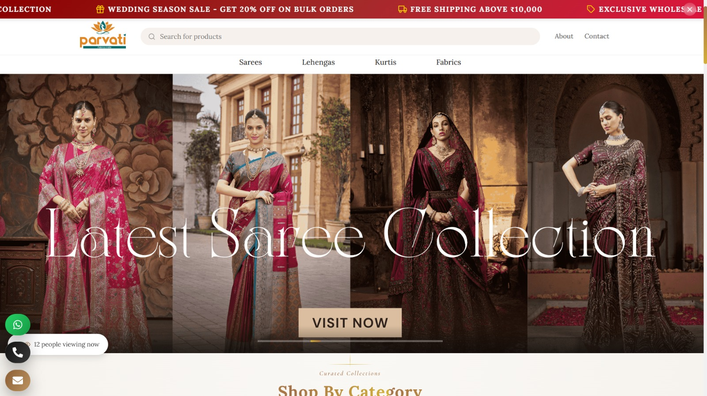
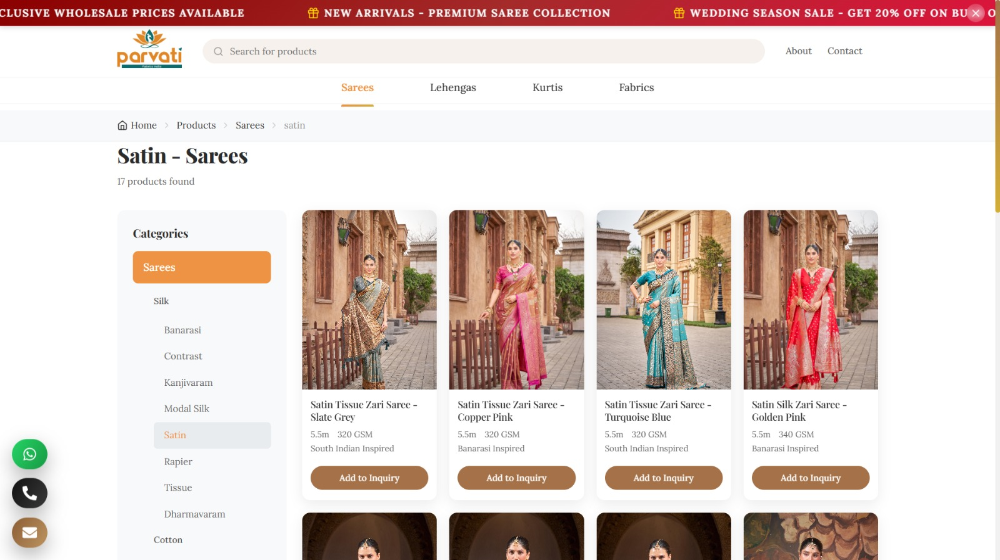
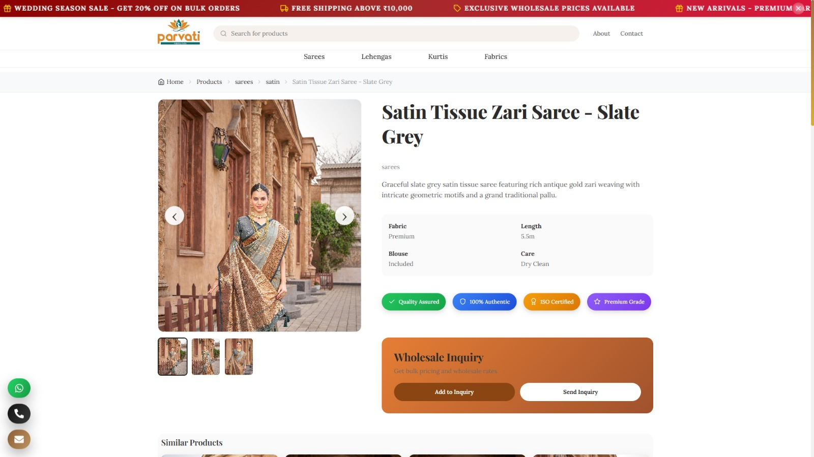
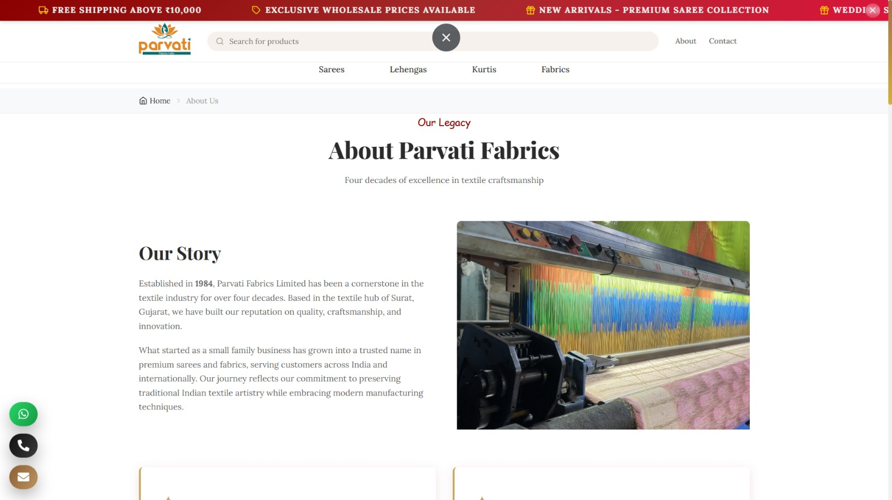
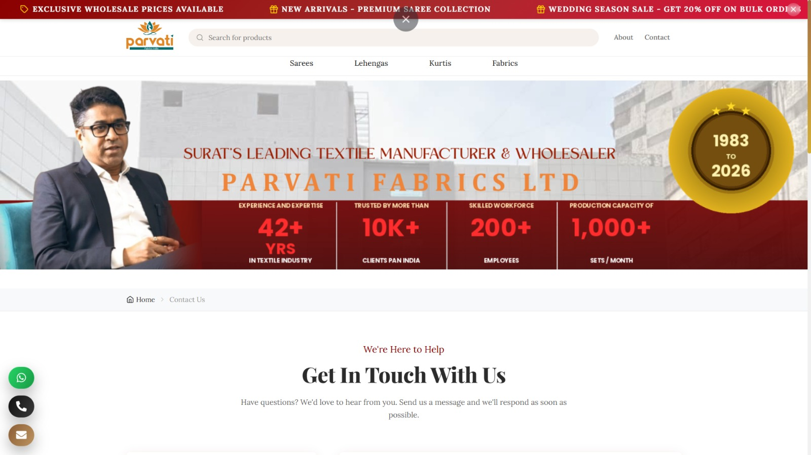
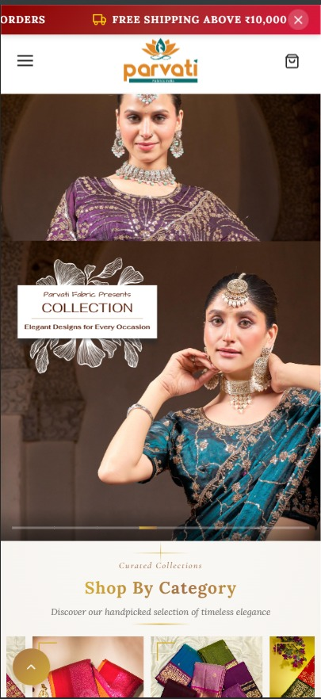
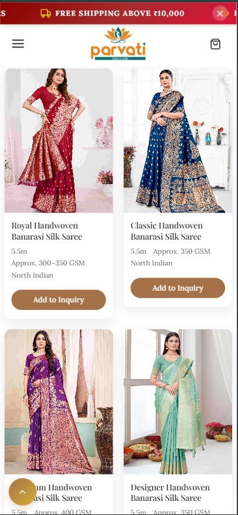

# 🧵 Parvati Fabric Website

<div align="center">


**A modern, responsive e-commerce website for Parvati Fabrics Limited - Celebrating 42+ years of textile excellence**

[Live Demo](https://parvatiethnics.com/)

</div>

---

## 📋 Table of Contents

- [About The Project](#about-the-project)
- [Key Features](#key-features)
- [Pages Overview](#pages-overview)
- [Tech Stack](#tech-stack)
- [Project Structure](#project-structure)
- [Getting Started](#getting-started)
- [Available Scripts](#available-scripts)
- [Core Functionalities](#core-functionalities)
- [Screenshots](#screenshots)
- [Contributing](#contributing)
- [License](#license)
- [Contact](#contact)

---

## 🎯 About The Project

Parvati Fabrics Website is a premium e-commerce platform showcasing an extensive collection of traditional and contemporary Indian textiles. Established in 1984, Parvati Fabrics Limited has been a cornerstone in the textile industry for over four decades, specializing in premium sarees, lehengas, kurtis, and fabrics.

### 🏢 Company Overview

- **Founded:** 1984
- **Location:** Ring Road, Surat, Gujarat, India
- **Specialization:** Premium Indian Textiles & Sarees
- **Production Capacity:** 10,000+ pieces/month
- **Manufacturing Facility:** 50,000 sq. ft. with 200+ power looms and 50+ handlooms
- **Workforce:** 200+ skilled employees
- **Market Reach:** 10,000+ clients Pan India

---

## ✨ Key Features

### 🎨 User Experience
- ⚡ **Lightning Fast Performance** - Built with Vite for optimal loading speeds
- 📱 **Fully Responsive Design** - Seamless experience across all devices
- 🎭 **Smooth Animations** - Elegant transitions using Framer Motion
- 🔍 **Advanced Search & Filters** - Multi-parameter product filtering
- 🎯 **Smart Product Recommendations** - AI-powered suggestions
- 💫 **Interactive UI Elements** - Engaging user interactions

### 🛍️ E-Commerce Features
- 🛒 **Inquiry Cart System** - Bulk inquiry management for wholesale
- ❤️ **Wishlist Functionality** - Save favorite products
- 📊 **Product Comparison** - Compare multiple products side-by-side
- 🔄 **Recently Viewed Products** - Track browsing history
- 📦 **Bulk Order Support** - MOQ calculator for wholesale buyers
- 💬 **WhatsApp Integration** - Direct product inquiries via WhatsApp
- 📞 **Video Call Shopping** - Shop via video consultation

### 🎨 Product Features
- 🖼️ **360° Product Viewer** - Interactive product visualization
- 🎥 **Product Videos** - Video demonstrations
- 🎨 **Color Variant Switcher** - Multiple color options
- 📸 **Image Gallery with Lightbox** - High-quality product images
- 🏷️ **Dynamic Tagging System** - Easy product categorization
- ⭐ **Ratings & Reviews** - Customer feedback system

### 📱 Mobile-First Features
- 📱 **Mobile Floating CTA** - Quick access to key actions
- 🎤 **Voice Search** - Hands-free product search
- 📷 **Camera Search** - Visual product search
- 💨 **Swipe Gallery** - Touch-optimized image browsing
- 📴 **Offline Mode** - Browse products without internet
- ⚡ **One-Tap Inquiry** - Quick inquiry submission

### 🎯 Business Features
- 📊 **Live Visitor Counter** - Real-time visitor tracking
- 📈 **Animated Statistics** - Company achievements showcase
- 🎪 **Seasonal Banners** - Festival and seasonal promotions
- 📰 **Newsletter Signup** - Email marketing integration
- 🏆 **Trust Badges** - Certification and quality assurance
- 🌐 **SEO Optimized** - Enhanced search engine visibility

### 🎓 Educational Content
- 📚 **Fabric Care Instructions** - Product maintenance guides
- 🎨 **Weave Pattern Library** - Traditional weaving techniques
- 🗺️ **Regional Style Guide** - Indian textile heritage
- 🎉 **Festival Calendar** - Seasonal shopping guide
- 👗 **Draping Guide** - Saree draping tutorials

---

## 📄 Pages Overview

### 1. **Home Page** (`/`)
The landing page featuring:
- Hero section with promotional banners
- Product categories showcase
- Featured products carousel
- New arrivals section
- Why choose us section
- Animated company statistics
- Instagram feed integration
- Shipping information
- Video call shopping CTA
- Live visitor counter
- Recent activity feed

### 2. **Products Page** (`/products`, `/products/:category`, `/products/:category/:subcategory`)
Comprehensive product listing with:
- Category-based navigation sidebar
- Dynamic subcategory filtering
- Advanced search functionality
- Sort options (New, Popular)
- Infinite scroll loading
- Product grid with hover effects
- Coming soon placeholders
- Breadcrumb navigation
- Product count display

**Product Categories:**
- **Sarees** (Silk, Cotton, Work, Organza)
  - Silk: Banarasi, Contrast, Kanjivaram, Modal Silk, Satin, Rapier, Tissue, Dharmavaram
  - Cotton: Modal Cotton, Linean Cotton, Khadi, Handloom Cotton
  - Work: Tried Work, Embroidery, Machine Work, Zari, Stone, Mirror, Sequence, Resam, TyleNet
  - Organza: Plain, Embroidery, Zari Work, Stone Work
- **Lehengas** (Bridal, Sider, Designer)
- **Kurtis** (Straight, Anarkali, A-Line)
- **Fabrics** (Cotton, Silk, Linen, Wool, Denim, Polyester, Velvet)

### 3. **Product Detail Page** (`/product/:id`)
Individual product showcase featuring:
- High-resolution image gallery
- Product specifications
- Color variants
- Size options
- Add to inquiry cart
- Add to wishlist
- Share buttons
- Similar products
- Customer reviews
- 360° product viewer
- Quick view modal

### 4. **About Page** (`/about`)
Company information including:
- Company history and legacy (Since 1984)
- Mission and vision statements
- Leadership profile (CEO: Mr. Vikash Pacheriwal)
- Manufacturing facility details
- Production process (6-step workflow)
- Factory statistics
- Why choose us section
- Company achievements
- Quality assurance information

### 5. **Contact Page** (`/contact`)
Contact information and inquiry form:
- Contact form with validation
- Company address and location
- Phone and email details
- Working hours
- Google Maps integration
- Multiple contact methods
- Quick inquiry submission

### 6. **Wishlist Page** (`/wishlist`)
Saved products management:
- Wishlist product grid
- Remove from wishlist
- Add to inquiry cart
- Empty state handling

---

## 🛠️ Tech Stack

### Frontend Framework
- **React 18.3** - Modern UI library with hooks
- **Vite 7.2** - Next-generation frontend tooling

### Styling & UI
- **Styled Components 6.3** - CSS-in-JS styling solution
- **Framer Motion 12.27** - Production-ready animation library
- **React Icons 5.5** - Popular icon library

### Routing & Navigation
- **React Router DOM 7.12** - Client-side routing

### State Management
- **React Context API** - Global state management
  - CartContext - Shopping cart state
  - InquiryContext - Inquiry cart state

### HTTP & API
- **Axios 1.13** - Promise-based HTTP client

### UI Components
- **Swiper 12.0** - Modern mobile touch slider
- **React Toastify 11.0** - Toast notifications

### SEO & Meta
- **React Helmet Async 2.0** - Document head management

### PWA Support
- **Vite Plugin PWA 1.2** - Progressive Web App capabilities

### Development Tools
- **ESLint 9.39** - Code linting
- **Vite Plugin React 5.1** - Fast refresh support

---

## 📁 Project Structure

```
parvati-fabric-website/
├── frontend/
│   ├── public/
│   │   ├── data/
│   │   │   └── products.json          # Product data
│   │   ├── images/
│   │   │   ├── banners/               # Hero banners
│   │   │   ├── categories/            # Category images
│   │   │   ├── icons/                 # Icon assets
│   │   │   ├── products/              # Product images
│   │   │   └── showcase_products/     # Featured products
│   │   └── videos/
│   │       └── products/              # Product videos
│   │
│   ├── src/
│   │   ├── assets/
│   │   │   ├── fonts/                 # Custom fonts
│   │   │   ├── icons/                 # SVG icons
│   │   │   └── images/                # Static images
│   │   │
│   │   ├── components/
│   │   │   ├── about/                 # About page components
│   │   │   ├── auth/                  # Authentication components
│   │   │   │   ├── LoginForm.jsx
│   │   │   │   ├── RegisterForm.jsx
│   │   │   │   └── ForgotPassword.jsx
│   │   │   ├── b2b/                   # B2B features
│   │   │   │   ├── WholesalePortal.jsx
│   │   │   │   └── MOQCalculator.jsx
│   │   │   ├── business/              # Business components
│   │   │   │   ├── CompanyStats.jsx
│   │   │   │   ├── ShippingInfo.jsx
│   │   │   │   └── MediaMentions.jsx
│   │   │   ├── cart/                  # Cart functionality
│   │   │   │   ├── CartDrawer.jsx
│   │   │   │   ├── CartItem.jsx
│   │   │   │   ├── CartSummary.jsx
│   │   │   │   └── AddToCartButton.jsx
│   │   │   ├── common/                # Reusable components
│   │   │   │   ├── Container.jsx
│   │   │   │   ├── Breadcrumb.jsx
│   │   │   │   ├── Toast.jsx
│   │   │   │   ├── Loader.jsx
│   │   │   │   ├── BackToTop.jsx
│   │   │   │   ├── ScrollProgress.jsx
│   │   │   │   ├── PageTransition.jsx
│   │   │   │   ├── AnimatedCount.jsx
│   │   │   │   ├── FloatingCTA.jsx
│   │   │   │   ├── SearchBar.jsx
│   │   │   │   └── InquiryModal.jsx
│   │   │   ├── contact/               # Contact components
│   │   │   ├── education/             # Educational content
│   │   │   │   ├── CareInstructions.jsx
│   │   │   │   ├── FestivalCalendar.jsx
│   │   │   │   ├── RegionalStyleGuide.jsx
│   │   │   │   └── WeavePatternLibrary.jsx
│   │   │   ├── engagement/            # User engagement
│   │   │   │   ├── NewsletterSignup.jsx
│   │   │   │   └── LiveProductFeed.jsx
│   │   │   ├── filters/               # Product filters
│   │   │   │   ├── CategoryFilter.jsx
│   │   │   │   ├── ColorFilter.jsx
│   │   │   │   ├── PriceFilter.jsx
│   │   │   │   ├── FabricFilter.jsx
│   │   │   │   └── ComprehensiveFilter.jsx
│   │   │   ├── home/                  # Home page sections
│   │   │   │   ├── HeroSection.jsx
│   │   │   │   ├── Categories.jsx
│   │   │   │   ├── FeaturedProducts.jsx
│   │   │   │   ├── NewArrivals.jsx
│   │   │   │   ├── WhyChooseUs.jsx
│   │   │   │   ├── AnimatedStats.jsx
│   │   │   │   ├── LiveVisitorCounter.jsx
│   │   │   │   ├── RecentActivityFeed.jsx
│   │   │   │   ├── ShopViaVideoCall.jsx
│   │   │   │   └── SeasonalBannerStrip.jsx
│   │   │   ├── layout/                # Layout components
│   │   │   │   ├── Navbar.jsx
│   │   │   │   ├── Footer.jsx
│   │   │   │   ├── PremiumFooter.jsx
│   │   │   │   ├── MobileMenu.jsx
│   │   │   │   └── FloatingInquiryCart.jsx
│   │   │   ├── mobile/                # Mobile-specific features
│   │   │   │   ├── MobileFloatingCTA.jsx
│   │   │   │   ├── InstagramFeed.jsx
│   │   │   │   ├── VoiceSearch.jsx
│   │   │   │   ├── CameraSearch.jsx
│   │   │   │   ├── SwipeGallery.jsx
│   │   │   │   ├── OfflineMode.jsx
│   │   │   │   └── OneTapInquiry.jsx
│   │   │   ├── premium/               # Premium features
│   │   │   │   ├── ArtisanProfiles.jsx
│   │   │   │   ├── HeritageStory.jsx
│   │   │   │   ├── SustainabilityStory.jsx
│   │   │   │   └── PremiumTypography.jsx
│   │   │   ├── products/              # Product components
│   │   │   │   ├── ProductCard.jsx
│   │   │   │   ├── ProductGrid.jsx
│   │   │   │   ├── ProductViewer360.jsx
│   │   │   │   ├── FiltersBar.jsx
│   │   │   │   ├── SortBar.jsx
│   │   │   │   ├── InfiniteLoader.jsx
│   │   │   │   ├── QuickViewModal.jsx
│   │   │   │   ├── WishlistButton.jsx
│   │   │   │   ├── ShareButtons.jsx
│   │   │   │   ├── ColorVariantSwitcher.jsx
│   │   │   │   ├── InquiryTray.jsx
│   │   │   │   ├── BulkInquiryCart.jsx
│   │   │   │   ├── AIRecommendations.jsx
│   │   │   │   └── SimilarProducts.jsx
│   │   │   ├── reviews/               # Review system
│   │   │   │   └── ReviewsSection.jsx
│   │   │   ├── saree-specific/        # Saree features
│   │   │   │   └── DrapingGuide.jsx
│   │   │   ├── social/                # Social proof
│   │   │   │   ├── CustomerGallery.jsx
│   │   │   │   └── CertificationBadges.jsx
│   │   │   └── trust/                 # Trust elements
│   │   │       └── TrustBadges.jsx
│   │   │
│   │   ├── contexts/
│   │   │   ├── CartContext.jsx        # Shopping cart state
│   │   │   └── InquiryContext.jsx     # Inquiry cart state
│   │   │
│   │   ├── data/
│   │   │   ├── categories.js          # Category definitions
│   │   │   ├── products.js            # Product data
│   │   │   ├── sarees.js              # Saree collection
│   │   │   ├── lehengas.js            # Lehenga collection
│   │   │   ├── kurtis.js              # Kurti collection
│   │   │   └── fabrics.js             # Fabric collection
│   │   │
│   │   ├── hooks/
│   │   │   ├── useAuth.js             # Authentication hook
│   │   │   ├── useCart.js             # Cart management hook
│   │   │   ├── useWishlist.js         # Wishlist hook
│   │   │   ├── useInquiry.js          # Inquiry hook
│   │   │   ├── useCompare.js          # Product comparison hook
│   │   │   └── useRecentlyViewed.js   # Recently viewed hook
│   │   │
│   │   ├── pages/
│   │   │   ├── Home.jsx               # Home page
│   │   │   ├── About.jsx              # About page
│   │   │   ├── Contact.jsx            # Contact page
│   │   │   ├── Products.jsx           # Products listing
│   │   │   ├── ProductDetail.jsx      # Product details
│   │   │   ├── Wishlist.jsx           # Wishlist page
│   │   │   ├── Cart.jsx               # Cart page
│   │   │   ├── Checkout.jsx           # Checkout page
│   │   │   ├── Seasonal.jsx           # Seasonal collections
│   │   │   └── NotFound.jsx           # 404 page
│   │   │
│   │   ├── routes/
│   │   │   └── AppRoutes.jsx          # Route definitions
│   │   │
│   │   ├── services/
│   │   │   ├── api.js                 # API configuration
│   │   │   ├── authService.js         # Authentication service
│   │   │   └── productService.js      # Product service
│   │   │
│   │   ├── styles/
│   │   │   ├── GlobalStyles.js        # Global CSS styles
│   │   │   ├── GlobalFonts.js         # Font definitions
│   │   │   ├── theme.js               # Theme configuration
│   │   │   ├── premiumTheme.js        # Premium theme
│   │   │   ├── mixins.js              # CSS mixins
│   │   │   └── visualEffects.js       # Visual effects
│   │   │
│   │   ├── utils/
│   │   │   ├── constants.js           # App constants
│   │   │   ├── helpers.js             # Helper functions
│   │   │   ├── filterProducts.js      # Product filtering logic
│   │   │   ├── search.js              # Search utilities
│   │   │   ├── imageHelper.js         # Image utilities
│   │   │   └── imageOptimizer.js      # Image optimization
│   │   │
│   │   ├── App.jsx                    # Main App component
│   │   ├── main.jsx                   # Entry point
│   │   ├── App.css                    # App styles
│   │   └── index.css                  # Base styles
│   │
│   ├── .gitignore
│   ├── eslint.config.js               # ESLint configuration
│   ├── index.html                     # HTML template
│   ├── package.json                   # Dependencies
│   ├── package-lock.json
│   ├── vite.config.js                 # Vite configuration
│   └── README.md
│
├── screenshots/                       # Project screenshots
└── README.md                          # Main documentation
```

---

## 🚀 Getting Started

### Prerequisites

Ensure you have the following installed:
- **Node.js** (v16 or higher)
- **npm** (v7 or higher) or **yarn**

### Installation

1. **Clone the repository**
   ```bash
   git clone https://github.com/Kiranpokharkar2003/parvati-fabric-website.git
   cd parvati-fabric-website
   ```

2. **Navigate to frontend directory**
   ```bash
   cd frontend
   ```

3. **Install dependencies**
   ```bash
   npm install
   ```
   or
   ```bash
   yarn install
   ```

### Development

Start the development server:
```bash
npm run dev
```

The application will be available at `http://localhost:5173`

To run on network (accessible from other devices):
```bash
npm run dev:network
```

### Build for Production

Create an optimized production build:
```bash
npm run build
```

The build files will be generated in the `dist/` directory.

### Preview Production Build

Preview the production build locally:
```bash
npm run preview
```

### Linting

Run ESLint to check code quality:
```bash
npm run lint
```

---

## 📜 Available Scripts

| Script | Description |
|--------|-------------|
| `npm run dev` | Start development server with host access |
| `npm run dev:network` | Start development server accessible on network |
| `npm run build` | Build for production |
| `npm run preview` | Preview production build |
| `npm run lint` | Run ESLint |

---

## ⚙️ Core Functionalities

### 1. **Product Management**
- Dynamic product catalog with 1000+ products
- Category and subcategory organization
- Product variants (colors, sizes)
- Product tagging system
- Search and filter capabilities
- Infinite scroll pagination

### 2. **Inquiry System**
- Add products to inquiry cart
- Bulk inquiry management
- WhatsApp integration for inquiries
- MOQ calculator for wholesale
- Inquiry form submission

### 3. **User Engagement**
- Wishlist functionality
- Recently viewed products
- Product comparison
- Live visitor counter
- Recent activity feed
- Newsletter subscription

### 4. **Mobile Features**
- Voice search
- Camera search
- Offline mode
- One-tap inquiry
- Swipe gallery
- Mobile-optimized UI

### 5. **Business Features**
- B2B wholesale portal
- MOQ calculator
- Bulk order support
- Video call shopping
- Company statistics
- Trust badges

### 6. **SEO & Performance**
- Server-side rendering ready
- Meta tags optimization
- Lazy loading images
- Code splitting
- PWA support
- Fast page loads

---

## 📸 Screenshots

### Home Page


### Products Listing


### Product Detail


### About Us


### Contact Us


### Mobile View



---

## 🤝 Contributing

Contributions are what make the open-source community such an amazing place to learn, inspire, and create. Any contributions you make are **greatly appreciated**.

1. Fork the Project
2. Create your Feature Branch (`git checkout -b feature/AmazingFeature`)
3. Commit your Changes (`git commit -m 'Add some AmazingFeature'`)
4. Push to the Branch (`git push origin feature/AmazingFeature`)
5. Open a Pull Request

---

## 📝 License

All rights reserved. © 2024 Parvati Fabrics Limited

This project is proprietary and confidential. Unauthorized copying, distribution, or use of this software is strictly prohibited.

---

## 📞 Contact

**Parvati Fabrics Limited**

- 📍 **Address:** F- Tower, Shree Kuberji Textile Park, Delhi Gate, Japan Market, Begampura, Surat, Gujarat 395003
- 📞 **Phone:** +91 92652 82488
- 📧 **Email:** parvatifabrics@gmail.com
- 🌐 **Website:** [www.parvatifabrics.com](https://parvatiethnics.com/)

**Developer**

- 👨‍💻 **Name:** Kiran Pokharkar
- 🔗 **GitHub:** [@Kiranpokharkar2003](https://github.com/Kiranpokharkar2003)
- 📧 **Email:** kiranpokharkar2003@gmail.com

---

## 🙏 Acknowledgments

- [React](https://reactjs.org/)
- [Vite](https://vitejs.dev/)
- [Styled Components](https://styled-components.com/)
- [Framer Motion](https://www.framer.com/motion/)
- [React Router](https://reactrouter.com/)
- [Swiper](https://swiperjs.com/)
- [React Icons](https://react-icons.github.io/react-icons/)

---

<div align="center">

**Made with ❤️ by Kiran Pokharkar**

⭐ Star this repository if you find it helpful!

</div>
